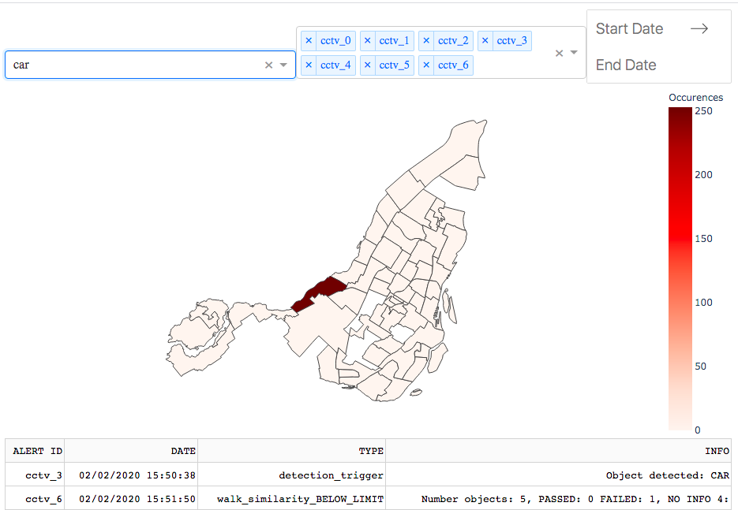

## About 

A small 1-day prototype of cctv camera tracking cars and humans. Records the paths of each identified object,
and stores in Redis database. Lastly, a visualization dashboard for viewing occurences for each cctv camera (video_id) and also show warnings. Conditions for warnings can be coded in for each camera id (e.g. if car is found in video_id 5 then show warning).

# Pytorch deepsort from https://github.com/ZQPei/deep_sort_pytorch
# Run redis server
# Run app.py visualization app (/dashboard)

## From Pytorch deepsort:

2. Download YOLOv3 parameters
```
cd detector/YOLOv3/weight/
wget https://pjreddie.com/media/files/yolov3.weights
wget https://pjreddie.com/media/files/yolov3-tiny.weights
cd ../../../
```

3. Download deepsort parameters ckpt.t7
```
cd deep_sort/deep/checkpoint
# download ckpt.t7 from 
https://drive.google.com/drive/folders/1xhG0kRH1EX5B9_Iz8gQJb7UNnn_riXi6 to this folder
cd ../../../
```  

4. Compile nms module
```bash
cd detector/YOLOv3/nms
sh build.sh
cd ../../..
```

## Run
```
usage: python cctv_run.py VIDEO_PATH
                                [--help] 
                                [--frame_interval FRAME_INTERVAL]
                                [--config_detection CONFIG_DETECTION]
                                [--config_deepsort CONFIG_DEEPSORT]
                                [--video_id CCTV_VIDEO_ID]
                                [--ignore_display]
                                [--display_width DISPLAY_WIDTH]
                                [--display_height DISPLAY_HEIGHT]
                                [--save_path SAVE_PATH]          
                                [--cpu]          

## Example outputs



